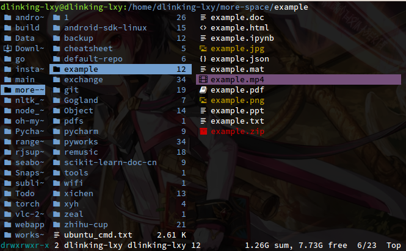
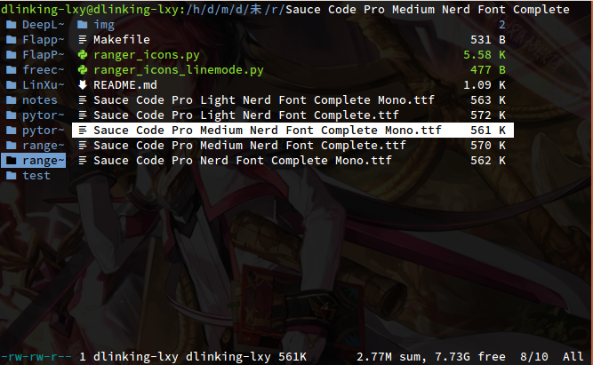
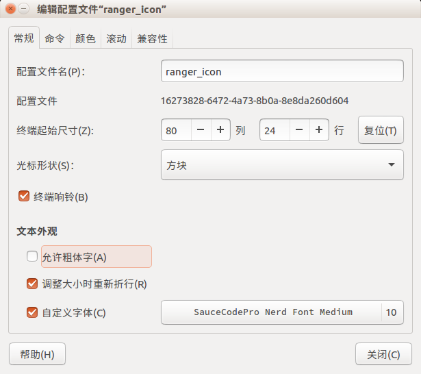

# ranger_icon_plugin
# File icons for Ranger file manager

This plugin introduces a new linemode that prefixes file names with a file icon




## Install and Uninstall

one line to install:
```shell
git clone https://github.com/LinXueyuanStdio/ranger_icon_plugin && cd ranger_icon_plugin && make install
```

The makefile is included to install and uninstall this plugin.

To install, simply run:
```shell
make install
```

To uninstall the plugin run:
```shell
make uninstall
```

## Requisites

This plugin uses glyphs from a patched NERDfont. So in order for this plugin to work you need to
install a NERDfont and set it as the default font for your terminal.

I personally use the `Source Code Pro` patched NERDfont(this is also the font displayed in the
screenshot).

I provide some font files to make it easier to install.

- move the font file to `~/.local/share/fonts`
- set it as the default font for your terminal

it looks like this:



> more fonts can be found in the following repository:
> [https://github.com/ryanoasis/nerd-fonts](https://github.com/ryanoasis/nerd-fonts)

